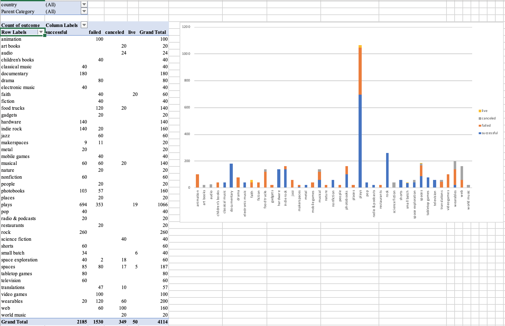

# Kickstarter_Excel_Challange

## Excel - Kickstarter Report

1.	Given the provided data, what are three conclusions we can draw about Kickstarter campaigns?
I.	The success rate of a Kickstarter project is highly dependent on the percent funded and average amount donated towards a project. 
a)	Successful projects have an average percentage funded rate of 1764% and an average donation of $93.66
b)	Failed projects have an average percentage funded rate of 9% and an average donation of $74.25.  It also should be noted that about 287 out of the total 1,530 failed projects have error or $0.
c)	Projects that have been canceled have an average percentage funded rate of 69%.  Even though most of the projects that managed to receive funding, received an average donation of $117.29, 117 of these projects, out 349, received 0 funding. 
d)	Projects that are currently live have an average percentage funded rate of 31% (with percentage ranging from 0% to 128%).  We can guess that the 9 projects in the ‘Percent Funded’ that are green, will most likely be the projects that will end up becoming successful. 
II.	Theatre and plays are the most popular and funded projects.  Even though the success rate for this category and sub-category is over 50% successful, the amount of successful theater/play are much higher than the other categories and sub-categories. 

III.	It looks like the Summer months are the worst time to have a deadline for a project.  There is a steep decline of successful projects between May and September. There was a loss of successful projects within these months.  Compared to the number of failed projects, that amount rose during the same months, with the highest peak in July. 

2.	What are some limitations of this dataset?
I.	There are limitations on the amount of projects tat are funded per country and the number of categories, per country that are successful/failed/currently live/are canceled.  For example, for Belgium, there were represented by only 2 categories, photography and food, with the former having 1 successful project and the latter having 1 failed project.   Compared to the US, that has projects in every category, with successful, failed, live and canceled projects spread in between all nine categories.   
II.	Another limitation is that Kickstarter is an American company, so it makes sense that the US would have more projects than any other country.
3.	What are some other possible tables and/or graphs that we could create?
I.	Graphs showcasing the different categories per country.
II.	A chart showcasing the number of backers per state of a project.
III.	A graph showcasing the average donation, from backers, per category. 
IV.	A chart showcasing a range of different goal amounts with the percent funded, per sub-category. 

_____________________________________________________________________________________________________________________

# Excel Homework: Kickstart My Chart

## Background

Over $2 billion has been raised using the massively successful crowdfunding service, Kickstarter, but not every project has found success. Of the more than 300,000 projects launched on Kickstarter, only a third have made it through the funding process with a positive outcome.

Getting funded on Kickstarter requires meeting or exceeding the project's initial goal, so many organizations spend months looking through past projects in an attempt to discover some trick for finding success. For this week's homework, you will organize and analyze a database of 4,000 past projects in order to uncover any hidden trends.

### Before You Begin

1. Create a new repo for this project called `excel-challenge` on GitHub. **Do not add this homework to an existing repository**.

2. Store your excel workbooks in here and create a sharable link for submission.

## Instructions

Using the Excel table provided, modify and analyze the data of 4,000 past Kickstarter projects as you attempt to uncover some market trends.

* Use conditional formatting to fill each cell in the `state` column with a different color, depending on whether the associated campaign was successful, failed, or canceled, or is currently live.

  * Create a new column O called `Percent Funded` that uses a formula to uncover how much money a campaign made to reach its initial goal.

* Use conditional formatting to fill each cell in the `Percent Funded` column using a three-color scale. The scale should start at 0 and be a dark shade of red, transitioning to green at 100, and blue at 200.

  * Create a new column P called `Average Donation` that uses a formula to uncover how much each backer for the project paid on average.

  * Create two new columns, one called `Category` at Q and another called `Sub-Category` at R, which use formulas to split the `Category and Sub-Category` column into two parts.

  

  * Create a new sheet with a pivot table that will analyze your initial worksheet to count how many campaigns were successful, failed, canceled, or are currently live per **category**.

  * Create a stacked column pivot chart that can be filtered by country based on the table you have created.

  

  * Create a new sheet with a pivot table that will analyze your initial sheet to count how many campaigns were successful, failed, or canceled, or are currently live per **sub-category**.

  * Create a stacked column pivot chart that can be filtered by country and parent-category based on the table you have created.

* The dates stored within the `deadline` and `launched_at` columns use Unix timestamps. Fortunately for us, [there is a formula](https://www.extendoffice.com/documents/excel/2473-excel-timestamp-to-date.html) that can be used to convert these timestamps to a normal date.

  * Create a new column named `Date Created Conversion` that will use [this formula](https://www.extendoffice.com/documents/excel/2473-excel-timestamp-to-date.html) to convert the data contained within `launched_at` into Excel's date format.

  * Create a new column named `Date Ended Conversion` that will use [this formula](https://www.extendoffice.com/documents/excel/2473-excel-timestamp-to-date.html) to convert the data contained within `deadline` into Excel's date format.

  

  * Create a new sheet with a pivot table with a column of `state`, rows of `Date Created Conversion`, values based on the count of `state`, and filters based on `parent category` and `Years`.

  * Now create a pivot chart line graph that visualizes this new table.

* Create a report in Microsoft Word and answer the following questions.

1. Given the provided data, what are three conclusions we can draw about Kickstarter campaigns?
2. What are some limitations of this dataset?
3. What are some other possible tables and/or graphs that we could create?

## Bonus

* Create a new sheet with 8 columns:

  * `Goal`
  * `Number Successful`
  * `Number Failed`
  * `Number Canceled`
  * `Total Projects`
  * `Percentage Successful`
  * `Percentage Failed`
  * `Percentage Canceled`

* In the `Goal` column, create 12 rows with the following headers:

  * Less than 1000
  * 1000 to 4999
  * 5000 to 9999
  * 10000 to 14999
  * 15000 to 19999
  * 20000 to 24999
  * 25000 to 29999
  * 30000 to 34999
  * 35000 to 39999
  * 40000 to 44999
  * 45000 to 49999
  * Greater than or equal to 50000

  

* Using the `COUNTIFS()` formula, count how many successful, failed, and canceled projects were created with goals within the ranges listed above. Populate the `Number Successful`, `Number Failed`, and `Number Canceled` columns with this data.

* Add up each of the values in the `Number Successful`, `Number Failed`, and `Number Canceled` columns to populate the `Total Projects` column. Then, using a mathematical formula, find the percentage of projects that were successful, failed, or canceled per goal range.

* Create a line chart that graphs the relationship between a goal's amount and its chances at success, failure, or cancellation.

## Bonus Statistical Analysis

If one were to describe a successful crowdfunding campaign, most people would use the number of campaign backers as a metric of success. One of the most efficient ways that data scientists characterize a quantitative metric, such as the number of campaign backers, is by creating a summary statistics table.

For those looking for an additional challenge, you will evaluate the number of backers of successful and unsuccessful campaigns by creating **your own** summary statistics table.

* Create a new worksheet in your workbook, and create a column each for the number of backers of successful campaigns and unsuccessful campaigns.

  

* Use Excel to evaluate the following for successful campaigns, and then for unsuccessful campaigns:

  * The mean number of backers.

  * The median number of backers.

  * The minimum number of backers.

  * The maximum number of backers.

  * The variance of the number of backers.

  * The standard deviation of the number of backers.

* Use your data to determine whether the mean or the median summarizes the data more meaningfully.

* Use your data to determine if there is more variability with successful or unsuccessful campaigns. Does this make sense? Why or why not?

## Submission

* To submit your homework, upload the solution and files to a GitHub repo, Dropbox, or Google Drive and submit the link to <https://bootcampspot.com/>.

## Employer-Ready Criteria

Students who are marked as employer-ready gain access to our employer referral program, additional workshops, and other resources. Work with your Career Director to become employer-ready. At a minimum, you must have:

- A clear, concise, and compelling resume. Submit via your learning platform for review.
- A polished GitHub profile:
  - 3 - 6 pinned repositories ([instructions here](https://docs.github.com/en/enterprise/2.13/user/articles/pinning-items-to-your-profile))
  - at least 5 commits per repository
  - professional titles, i.e. not "Homework #1"
  - thorough README.md files for each repository
  - clean code

- - -

© 2019 Trilogy Education Services

